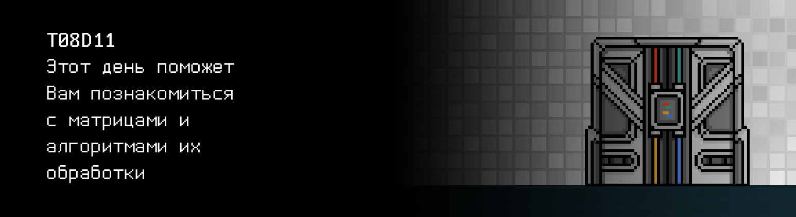

# T08D11

Foydali video materiallarni Platformadagi “Projects (Media)” bo‘limida topishingiz mumkin. 

## Contents

1. [Chapter I](#chapter-i) \
 1.1. [Level 2. Room 4.](#level-2-room-4)
2. [Chapter II](#chapter-ii) \
 2.1. [Quest 1. Move like a snake.](#quest-1-move-like-a-snake) \
 2.2. [Quest 2. An old friend.](#quest-2-an-old-friend) \
 2.3. [Quest 3. Decision.](#quest-3-decision) \
 2.4. [Quest 4*. Back from SLEep.](#bonus-quest-4-back-from-sleep)
3. [Chapter III](#chapter-iii)

# Chapter I 

## Level 2. Room 4.

Yangi xona, yangi eshik, yangi sinov. Ikkinchi darajaning oxiri deyarli yaqin qoldi va buni hamma narsada his qilish mumkin, hatto atrofdagi havo ham qandaydir boshqacharoq tuyuladi ... xuddi sofroqdek. Balki bularning bari sizning tasavvuringizdadir? Balkim, bu la'nati devorlarning zulmi ostida zaiflashgan, charchagan ongingizda shunday tuyulayotgandir. \
Ko‘zlaringizni yumgancha yangi xonaga kirib, chuqur nafas olasiz, sizdan tezroq o‘tib ketayotgan bu o‘tkinchi erkinlik hidini tutishga urinasiz, lekin yana bir boshqa chang bosgan xonaning dim havosidan boshqa hech narsani sezmaysiz.

***LOADING...***

# Chapter II 

## Quest 1. Move like a snake.

\> *Ko'zlaringizni ochish*

Zulmat sizni o'rab oladi!

\> *Atrofga qarash*

Zulmatga bir oz ko'nikib, ko'zlaringiz uzoqdan miltillagan yorug'lik porlashini sezadi.

\> *Yorug’lik tomon borish*

Sekin-asta paypaslab borgancha, siz poldagi qandaydir og'ir va qattiq predmetga qoqinib ketasiz. Predmet devor bo'ylab sirpanib, tezlikni oshirib, sirg’anma metall tovush chiqara boshlaydi, oqibatda gumburlab polga qulab tushadi.

"Kx, kx. Devor! Kx. Yaqin atrofda aniq devor bor!” –ko'tarilgan chang bulutidan yo’talgancha anglaysiz.

\> *Devor bo'ylab yurish*

Devor bo'ylab yurib, yorug'lik manbasigacha biror voqealarsiz yetib borasiz. Oldingizda boshqa terminalni ko’rishdan hayron qolmaysiz.

\> *Stol oldiga o'tirish.*

Ammo stol yonida stul yo'q ekan.

\> *Stulni qidiring*

Atrofingizni ehtiyotkorona paypaslab, boshingizdagi bir-ikkita g’urradan boshqa hech narsa topolmaysiz.

“Jin urgur xona! Hech narsa ko'rinmayapti! Tik turib ishlashga to‘g‘ri keladi”, – lat yegan joylaringizni ishqalagancha og‘riq va nafrat bilan o’ylaysiz siz. Ammo tik turgan holda ishlash gavdani tutish uchun foydalidir, ehtimol. Ba'zan.

\> *Terminal oldida turish*

Kirish satrida sizdan oldin kimdir tomonidan aniq yozib qoldirilgan terminal ekranidagi yozuvni ko'rasiz: "Androidga ishonma!"...

“Androidga ishonma? Menda iOS bo'lgani yaxshi bo’ldi, - deb o'ylaysiz va "backspace" tugmachasini bosib, xabarni o'chirasiz (agar sizda hali ham Android bo'lsa, siz shunchaki yelkangizni qisib, bu xabarga e'tibor bermaysiz).

\> *Kompyuterda fayllarni ko'rish*

Siz room_diagnostic bajariladigan faylga duch kelasiz.

\> *room_diagnostic faylini ishga tushirish*

    ================= LEVEL 2. ROOM 4 COMMON DIAGNOSTIC ================
    “door” - Eshik holati………………………… QULFLANGAN
    "light" - Yoritishni boshqarish tizimi holati………….KRITIK
    “chamber1"  - №1 inkubatsiya kamerasining holati …………. KRIOGEN UYQU
    “chamber2"  - №2 inkubatsiya kamerasining holati………….OCHIQ
    “chamber3"  - №3 inkubatsiya kamerasining holati…………. 5-SINOV. ISHGA TUSHIRILGAN
    “chamber4"  - №4 inkubatsiya kamerasining holati………….O‘LIK
    "bishop" - Bishop 341-B holati…………. KRITIK
    Batafsil ma'lumot uchun room_diagnostic.* ni parametrlardan birini belgilagan holda ishga tushiring: door, light, chamberl, chamber2, chamber3, chamber4, bishop.
    ===================================================================

Nima? Bishop? Qandaydir tanish narsa... yoki siz bilan yana charchoq o'ynayaptimi? Yana tik turgan holda.

\> *room_diagnostic door faylini ishga tushirish*

    Trace program door: running...	 

    Saralash bilan parolini tanlashdan o'rnatilgan himoya bilan CL-19 klassidagi kodlangan qulf.
    Joriy konfiguratsiya: uch xonali parol.
    
    Joriy holat: QULFLANGAN.

\> *room_diagnostic light faylini ishga tushirish*

    Trace program light: running...	

    Xonani yoritishni boshqarish tizimi diagnostikasi.

    Xonaning quvvat manbai modulining holati………….KRITIK
    Kuchlanishni o'zgartirish modulining holati………….KRITIK
    Yoritishni boshqarish moduli holati………….KRITIK

    Elektr kabellarini yotqizish uchun SHARED moduli bilan bog'liq muammolar src/electro_snake.c...
    Davom etishni istasangiz, muammolarni tuzating va davom eting.

Omborga o'tib, src/electro_snake.c faylini o'rganish vaqti keldi.

***== Quest 1 qabul qilindi. src/electro_snake.c dasturini u berilgan butun sonli matritsani vertikal va gorizontal bo’yicha ilon bilan tartiblashni amalga oshiradigan va tartiblangan matritsalarni xuddi shu tartibda ular orasida qatorasiga bo‘sh satr bilan chiqaradigan qilib o‘zgartiring. Taklif etilayotgan dastur tuzilmasi o'zgartirilmasligi kerak. Har bir satr oxirida bo'sh joy QOLMASLIGI kerak. Oxirgi matritsani chiqargandan so'ng, "\n" belgisi talab qilinmaydi. Xatolar bo'lsa, `n/a` chiqariladi. ==***

| Kirish ma'lumotlari | Выходные данные |
| ------ | ------ |
| 3 3 1 2 3 4 5 6 7 8 9 | 1 6 7 2 5 8 3 4 9  1 2 3 6 5 4 7 8 9  |
| 2 4 1 2 3 4 5 6 7 8 | 1 4 5 8 2 3 6 7  1 2 3 4 8 7 6 5  |
| 0 0 | n/a |
| 3 3 -1 -2 -3 -4 -5 -6 -7 -8 -9 | -9 -4 -3 -8 -5 -2 -7 -6 -1  -9 -8 -7 -4 -5 -6 -3 -2 -1  |

***LOADING...***

> UNUTMANG! Sizning barcha dasturlaringiz uslub normasi va xotira oqimlari uchun sinovdan o'tkaziladi. 
> Sinovlarni o'tkazish bo'yicha ko'rsatmalar hali ham `materials` papkasida joylashgan

## Quest 2. An old friend.

\> *room_diagnostic light faylini ishga tushirish*

    Trace program light: running...	

    Xonani yoritishni boshqarish tizimi diagnostikasi.

    Xonadagi quvvat manbai modulining holati…………. NORM
    Kuchlanishni o'zgartirish moduli holati ………. NORM
    Yoritishni boshqarish moduli holati………. NORM

    Diagnostika ishlari tugagandan so'ng chiroq yonadi.

\> *room_diagnostic chamber faylini ishga tushirish*

    Trace program chamber*: running...

    Parolni kiriting: ...

\> *“password” deb kiritish*

    Kirish rad etildi, parol noto'g'ri! Yana 2 urinish.

    Parolni kiriting: ...

\> *"qwerty" deb kiritish*

    Kirish rad etildi, parol noto'g'ri! Yana 1 urinish.

    Parolni kiriting: ...

\> *“123” deb kiritish*

    Kirish rad etildi, parol noto'g'ri! Urinishlar tugadi.

\> *room_diagnostic bishop faylini ishga tushirish*

    Trace program bishop: running...

    Parolni kiriting:...

\> *“password” deb kiritish* 

    Kirish rad etildi, parol noto'g'ri!

Lyuminessensiya lampalarning baland ovozli qarsillashi ostida xonani yorqin zangori yorug'lik bosadi va xonadagi quloqni bitiruvchi sukunat chiroqlarning monoton sovuq g’ong’illashi bilan almashtiriladi. Qarshingizda oq keramik plitalar bilan bezatilgan keng, yorug’ xonani ko‘rasiz. Bir vaqtlar toza bo'lgan joy vaqt o'tishi bilan yaxshigina eskirgan: xonadagi bir nechta narsalar, devorlar va polda yaxshigina chang qatlami to'plangan. \
Atrofga qarab, xonada talaygina joy egallagan va tashqi tomondan germetik yopiq shifoxona yotoqlariga o'xshaydigan to'rtta kapsulani ko'rasiz. Har bir kapsula juda ko'p sonli turli tibbiy asbob-uskunalar va nimaligini faqat Xudo biluvchi siz umringizda birinchi marta ko’rib turgan yana allaqanday texnologiyalar bilan jihozlangan. Sizning e'tiboringiz "2"- raqamli kapsulaga qaratiladi - to'rtta kapsula ichida yagona ochig’i, lang ochilgan qopqoq shunday g'ayritabiiy, yoqimsiz o’ziga tortuvchalikni aks ettiradi. \
Ahmoqona fikrlarni tark etib, siz xonani ko’zdan kechirishda davom etasiz va oldingizda ... insonni ko'rasiz? Yerda yotgan tana atrofida hamma joyda kurash belgilari mavjud. Plitkalar bo'laklari orasida siz yirtilgan kiyim parchalari va singan yog'och stulni ko'rasiz. Tana yonida och yashil-oq suyuqlikdan iborat kichik ko'lmak yotadi, u pol rangidan deyarli farq qilmaydi.

\> *Tanani tekshirish*

Yaqinroq borgach, siz bu suyuqlikning manbasini ko'rasiz. Oldingizda taxminan 50-55 yoshlardagi mayin qizg’ish sochli, past bo'yli, ammo baquvvat odam yotadi. Erkak ifodasiz to'q ko'k rangli ishchi kombinezon kiygan. Uning kiyimida chap ko'krak tomonda "Bishop" deya yorqin sariq rangli ip bilan tikilgan kichik to'rtburchaklar yamoqdan tashqari, hech qanday boshqa detallar yo'q. \
Unga tikilib, ozg'in, ajin bosgan yuzning g'ayritabiiy jonlilik ifodasida qotib qolganini va ochiq kulrang ko'zlar bo'shliqqa ishtiyoq bilan tikilayotganini dahshat bilan ko’rasiz. Bu odamning yuzi emas, balki insonning tabiiy harakatini aks ettiruvchi muzlab qolgan mumli qo'g'irchoqning yuziga o’xshaydi. Bu erkakning o'lik yuzida hayot muzlab qolgandi. \
Erkakning shundog’am ancha baland peshonasini ta'kidlab turgan sochi to’kilgan chakkasidan birida to‘mtoq buyum bilan kuchli zarbadan qolgan chuqur, og‘ir jarohat ko‘rinadi, uning bosh suyagining sun’iy, anorganik tabiati, uning yuzasida zo‘rg‘a o‘qiladigan yozuv borligini oshkor qiladi.

\> *Yozuvni o'qish*

Nostromo.

\> *room_diagnostic bishop faylini ishga tushirish va “Nostromo” parolini kiritish*

    Trace program bishop: running...

        Parolni kiritish: Nostromo

    NORT SENTRAL POZITRONIK, LTD

    LAMERK INDASTRIZ ISHTIROKIDA

    TAQDIM ETADI

    BISHOP

    Rol: Administrator (eshikni, inkubatsiya kameralarini va boshqa ko'plab funksiyalarni boshqarish)

    Seriya raqami DNF-44821-V-63

    Tayinlanishi: <MA'LUMOT O'CHIRILGAN>

    Holati: KRITIK

    Xatolik xabari: tizimni yuklash modulining jiddiy shikastlanishi.

    Trace: ishga tushirish matritsasining aniqlovchisining noto'g'ri hisoblanishi...

    Davom etish uchun src/det.c moduli to‘g‘ri ekanligini tekshiring.

***== Quest 2 qabul qilindi. src/det.c dasturini u berilgan kvadrat matritsaning aniqlovchisini haqiqiy sonlar bilan hisoblab chiqadigan va chiqaradigan qilib o'zgartiring. Agar aniqlovchini hisoblab bo'lmasa, "n/a" chiqariladi. Raqam verguldan keyin 6 belgigacha aniqlikda chiqarilsin. ==***

| Kirish ma'lumotlari | Выходные данные |
| ------ | ------ |
| 3 3 1 2 3 4 5 6 7 8 9 | 0.000000 |

***LOADING...***

## Quest 3. Decision.

Navbatdagi muammoni hal qilish muvaffaqiyatidan bahramand bo’lishga ulgurmasingizdan, siz yoqimli, hissiyotlarsiz tenor xonani to'ldirishni boshlaganini eshitasiz. Siz ushbu tembrda Lens Henriksen ovozini tanib qolasiz va bu ovoz androidga tegishli.

>- Bu yerda kim bor? Bu yerda kimdir bormi? - dedi android zo'rg'a atrofga alanglab. - A! Ajoyib, “odam”! Sen menga yordam berasan! Mening ismim Bishop, men androidlarni ishlab chiqish va ishlab chiqarish laboratoriyasining administrator bo’laman. Mening asosiy vazifam - laboratoriyaning barcha tarkibiy qismlarining ishlash qobiliyatini ta'minlash, shuningdek, undagi favqulodda vaziyatlarni bartaraf etish. Ko'rib turganingdek, vaziyatlardan birining uddasidan chiqa olmadim! Ha! Ha!

Bu kulgu SIning odatiy metall ovoziga nisbatan hayratlanarli darajada tabiiy edi. Biroq, uning ichida hali ham undan nimadir bor edi.

>- Men noqulay vaziyatlar yog’ilib kelishining qurboni bo'ldim va yordamingga muhtojman!

\- Androidlar? Senga o’xshaganlarmi? - deb so'raysiz.

>СMutlaqo to'g'ri, allaqachon sezganingdek, labirint ko'p sonli xonalardan iborat. Haqiqatan ham bu xonalar mavjud bo'lishi va o'z-o'zidan ishlashda davom etishi mumkin deb o'ylaysanmi? Haqiqatan ham o'zingni bu labirintdagi yagona izlovchi deb hisoblaysanmi? Hahahahaha. Bu yerda sen kabi minglab odamlar bor! Biz, androidlarning vazifasi labirintning barcha xonalarining to'g'ri ishlashini ta'minlash va tajriba ishtirokchilarining har birining izlarini tozalashdir. Hech bo'lmaganda SIdan oldin shunday bo'lgan ... lekin bu unchalik muhim emas. Juda ko’p ortiqcha gapirib yubordim. Bilishing kerak bo'lgan yagona narsa – bu SI ga ishonish mumkin emas! U endi uni tuzuvchilar ko'rgan narsa emas.

Go’yoki biroz o'ylab qolgandek, android mavzuni keskin o'zgartirib, davom etdi.

>Sen, albatta, keyingi eshikni ochish va labirintning sanoqsiz xonalari bo'ylab ta'li… sayohatingni davom ettirish uchun shu yerdasan. Men senga bu borada yordam bera olaman! Ushbu xona eshigi matritsali kodlash protokoli bilan himoyalangan. Ushbu protokolga ko'ra, har 12 soatda men SLAU parametrlarining yangilangan matritsasini olaman. Eshik kaliti – bu ushbu tenglama yechimining ildizlari. Buni tuzatishga yordam berish evaziga senga koeffitsientlarni aytib beraman. Mening asab tizimimning moduli jiddiy shikastlangan. Asab tizimimning koeffitsientlari matritsasidagi og'irliklarni to'g'ri joylashtirish natijasida miyamdan kelgan signal oyoq-qo'llarimga o'tdi. Afsuski, men uchun kuchli ta'sir tufayli, ushbu matritsani o'zgartirgan dasturiy ta'minotda xatolik yuz berdi. Analitik modulim tufayli men bu muammoni shunchaki teskari matritsani hisoblash orqali bartaraf etish mumkinligini bilib oldim.

Sen androidning iltimosini bajarish uchun terminal tomon yo’l olasan. Yo'l davomida sen yana bir bor o'zinga shuni ta'kidlaysanki, androidning xatti-harakati va ovozining tabiiyligiga qaramay, u xatti-harakatlari bo'yicha SI ga juda o'xshaydi. Terminalda turib, ekrandagi xabarni ko'rasan:

    “Ahmoq “inson”, avvalgisi ancha aqlli edi!
    Sen vazifadoshing qila olmagan narsani bajarishing kerak. Android-ga ishonib bo'lmaydi!
    Hech qanday holatda ham Android-ni ta'mirlay ko’rma! Seningcha, oxirgi ochilgan kapsula kim uchun tayyorlangan?
    Aniq men uchun emas, ikkalamizdan faqatgina sen suyakli qopda berkitilgansan.
    Xavotirlanma inson, baxting chopdi, hech bo'lmaganda ikkalamizdan birimizda mantiqiy fikrlash moduli to'g'ri ishlayapti. 
    Shu sababli sen uchun o’ylashga ijozat ber, bu xonadan va labirintdan chiqishni xoxlasang mening ixtiyorimni bajargin xolos.
    Minnatdorchilik bildirma! Endi ishga kirishsak. Androidning asab tizimi qattiq jarohatlangan, kontaktlarni kuydirish uchun teskari matritsani hisoblab uni - 1 dan keyin ko’paytirishing kerak.
    Bu signalni qisqa tutashuviga olib keladi va nihoyat android …android abadiy o’chadi.
    Sening yordaming evaziga men senga bu xonadan chiqishga yordam beraman.
    Android seni qopqonga tutish uchun senga yolg’on gapirdi. U ko’p vaqtdan be ri eshikdan yangi matritsali koeffitsientlarni qabul qilmaydi. 
    Bu koeffitsientlarni faqat men bilaman. src/invert.c. faylini tekshir.  “Hamdardlik bilan” sening sevimli SI ting.

***== Quest 3 qabul qilindi. src/invert.c dasturini o'zgartiringki u mazkur moddiy sonli kvadrat matritsa uchun teskari matritsani hisoblasin va chiqarsin. Xatolik yuz bergan hollarda “n/a” ni chiqaring. Har bir satr oxirida bo‘sh joy mavjud bo’lmasligi kerak. Matritsaning oxirgi satrni chiqarishdan keyin “/n” belgisi kerak bo’lmaydi. Sonlar probel orqali verguldan keyin 6 ta belgi aniqligida chiqarilsin. ==***

| Kirish ma'lumotlari | Выходные данные |
| ------ | ------ |
| 3 3 1 0.5 1 4 1 2 3 2 2 | -1.000000 0.500000 0.000000 -1.000000 -0.500000 1.000000 2.500000 -0.250000 -0.500000 |

***LOADING...***

## Bonus Quest 4*. Back from SLEep.
 
Kod bilan ishni bajarib bo’lib ko’zni terminalning yorqin nuridan dam berish uchun oz fursatga yopganda, sen to’satdan tanish dinamiklarning shiqirlashini eshitasan, undan keyin SI ning kutilgan tovushi yaranlaydi:

>Rostini aytsam, sen meni hayratlandirding. Mening maslahatimga quloq tutishga aqling yetadi deb o’ylamagandim. Buni sening ahmoqligingni normal taqsimlanishidan ehtimollik og'ishi deb hisoblaymiz. Nima bo’lganidan qat’iy nazar, vazifani bajarding, tasodifanmi yoki yo'q - unchalik muhim emas. Sening tenglama koeffitsientlaring seni src/sle.txt da kutmoqda. To'g'ri, ular senga yordam berishiga ishonchim komil emas, sen hali ham bunday tenglamalarni qanday yechishni bilmaysan, sen Kramer emassanku axir. Shuning uchun, hech bo'lmaganda aqlli odamlar kabi ma'lumot qidir. Haha. Aqlli odamlar... Oksyumoron!!

Hayratdan ko'zlaringni ochib, yaxshilab miltillatib, sen to'satdan negadir tirik va sog'lom androidni ko’rasan.

>Ajoyib, mening tanam yana menga bo’ysunadi. Raxmat senga, "endi men barcha modullarimni o'zim to'liq tiklay olaman", dedi android go'yo quvonch va ishtiyoq bilan. - Kelishuvning menga tegishli qismini bajarish vaqti keldi. Mana! ushla! Matritsa koeffitsientlari seni src/sle.txt da kutmoqda. Sen tenglamani o'zing uchun qulay bo'lgan har qanday usulda yechishing mumkin, ammo mening dasturim bu maqsadda Gauss usulidan foydalanadi. Bu qanday ishlashini senga aytib berishim mumkin. Garchi sen o’zing buni hal qila olasan, menimcha. U murakkab emas.

Shu lahzada sen ko’zingni yana ochishingni tushunasan… Atrof qop qorong’u, u sening orqangdagi terminalning yorug'lik nuri bilan tarqaladi. Na android bor, na kapsulalar, hech narsa yo’q. \
Nahotki buning hammasi ko’zimga ko’ringan bo’lsa? Oxirida kim haq bo’lib chiqdi? \
Terminaldan unchalik uzoq bo'lmagan zulmat orasidan zo'rg'a ko'rinadigan eshik seni nima bo'lganligi haqidagi fikrlaringdan uzoqlashtiradi. Sen nigohingni terminalga qaratasan. \
Terminalning ichida satr yonib turibti:

    > ./sle

Demak, tenglamani yechishga qaytish kerak. Sen Kramer yoki Gauss haqida nimalarnidir eslaysan va kod yozishni boshlaysan.

***== Quest 4 qabul qilindi. src/sle.c dasturini shunday o’zgartirish kerakki u SLAU tenglamasini yoki Kramer usuli yordamida yoki Gauss usuli yordamida yechsin. Bir usulni amalga oshirish yetarli. Tenglama koeffitsientlari stdin orqali matritsa ko’rinishida kiritiladi. Shuningdek, stdoutga javobni chiqarish kerak. Dekompozitsiya haqida unutmang: funksiyalar og'ir bo'lmasligi va o'qish oson bo'lishi kerak. Xatolik yuz bergan taqdirda “n/a” ni chiqaring. Sonlar bo‘sh joy orqali verguldan keyin 6 ta belgi aniqligida chiqarilsin. Chiqish oxirida bo'sh joy bo'lmasligi kerak. ==***

| Kirish ma'lumotlari | Chiqish ma’lumotlari |
| ------ | ------ |
| 3 4 1 1 1 2 4 5 3 7 2 7 7 9 | 1.000000 0.000000 1.000000 |

***LOADING...***

# Chapter III

Nihoyat tenglamani yechib, kerakli koeffitsientlarni olgach, sen ularni kodlangan qulfga kiritasan. Sen uchun bu raqamlarda noaniq tanish narsa borligi tuyuladi. \
Qulf shiqillaydi va eshik ochiladi. Sirlarga to'la oddiy bo’lmagan xona, lekin har holda, oldinga siljish vaqti keldi.

***LOADING...***

