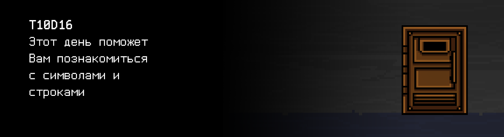

# T10D16

Foydali video materiallarni Platformadagi “Projects (Media)” bo‘limida topishingiz mumkin.![]

## Contents

1. [Chapter I](#chapter-i) \
 1.1. [Level 3. Room 2.](#level-3-room-2)
2. [Chapter II](#chapter-ii) \
    2.1. [List 1.](#list-1) \
    2.2. [List 2.](#list-2) 
3. [Chapter III](#chapter-iii) \
 3.1. [Quest 1. Strlen.](#quest-1-strlen) \
 3.2. [Quest 2. Strcmp.](#quest-2-strcmp) \
 3.3. [Quest 3. Strcpy.](#quest-3-strcpy) \
 3.4. [Quest 4. Strcat.](#quest-4-strcat) \
 3.5. [Quest 5. Strchr.](#quest-5-strchr) \
 3.6. [Quest 6. Strstr.](#quest-6-strstr) \
 3.7. [Quest 7. Strtok.](#quest-7-strtok) \
 3.8. [Quest 8*. Width.](#bonus-quest-8-width) 
4. [Chapter IV](#chapter-iv) 

# Chapter I

## Level 3. Room 2.

***LOADING Level 3… \
LOADING Room 2…***

Juda ko‘p kitoblar bor bo‘lgan yaxshi jihozlangan xonaga tushib qolding. Qayerga qarama, hamma joyda kitoblar bor. Eshik yonida kitoblar turibdi. Hatto kompyuter ham kitoblar ustida turibdi.

\> *Kompyuter oldiga o‘tirish, modulni ishga tushirish va Enter bosish

Ekranda quyidagi satrlarni ko‘rding:

    1111111111111111111111111111111111111111111111111111111111111111111111111111111111111111111
    1111111111111111111111111111111111111111111111111111111111111111111111111111111111111111111

    Favqulodda xabar: string.h kutubxonaning standart chaqiruvlari mavjud emas.
    Lingvistik moduli ishdan chiqdi.

\> *find -O3 -L / -name "string.h"*

n soat vaqt kutgach, kompyuterda bu kutubxona yo‘qligini tushunding.

\> *Eshik tutqichini tortish*

Bo’lmayapti.

\> *Zo‘r, bu kutubxonani ham tiklashga to‘g‘ri keladi, shekelli*

Xonada ko’p kitoblarni ko’rding. Kitoblar nomlari bir parcha qog’ozda alifbo tartibida yozilgan. \
Bu eski kompyuter adabiyoti va manual choplamasi shekelli. \
Ichingdagi ovoz string.h kutubxonasi bilan bog’liq bo’lgan kitobni izlashni aytyapti.

\> *Izlash...*

Bo’lmadi.

\> *Izlash...*

Bo’lmadi..

\> *Izlash...*

Bo’ldi. «The String.h - Linux manual. Complete edition» nomli kitobni topding.

\> *Kitobni ochish*

man-a nusxasiga o’hshaydi. Hatto shrift terminaldagiday.

***LOADING...***

# Chapter II

## List 1.

\> *Kitobni o’qish*

    PROLOG
       This manual page is part of the POSIX Programmer's Manual. The Linux
       implementation of this interface may differ (consult the
       corresponding Linux manual page for details of Linux behavior), or
       the interface may not be implemented on Linux.
    NAME 
       string.h — string operations
    SYNOPSIS
       #include <string.h>
    DESCRIPTION
       Some of the functionality described on this reference page extends
       the ISO C standard. Applications shall define the appropriate feature
       test macro (see the System Interfaces volume of POSIX.1‐2008, Section
       2.2, The Compilation Environment) to enable the visibility of these
       symbols in this header.

       The <string.h> header shall define NULL and size_t as described in
       <stddef.h>.

       The <string.h> header shall define the locale_t type as described in
       <locale.h>.

       The following shall be declared as functions and may also be defined
       as macros. Function prototypes shall be provided for use with ISO C
       standard compilers.

            Chapter 1 - size_t   strlen(const char *);
            Chapter 2 - int      strcmp(const char *, const char *);
            Chapter 3 - char    *strcpy(char *restrict, const char *restrict);
            Chapter 4 - char    *strcat(char *restrict, const char *restrict);
            Chapter 5 - char    *strchr(const char *, int);
            Chapter 6 - char    *strstr(const char *, const char *);
            Chapter 7 - size_t   strnlen(const char *, size_t);
            Chapter 8 - int      strncmp(const char *, const char *, size_t);
          
            ...

       Inclusion of the <string.h> header may also make visible all symbols
       from <stddef.h>.

Bu kutubxonada ko‘p funksiyalar bor ekan... Balki, interaktiv yol bilan borish kerakdir va har bir yangi qo’shilgan funksiyadan keyin dasturli modulni qayta yuklashga harakat qilish kerakdir. Ehtimol, unga hamma funksiyalar kerak emasdir..
Aks holda, ancha o’tirib qolish mumkin.

\> *Kompyutyer yoniga yana borish*

Kompyuter yoniga kelib, uning oldida yana bitta ochiq kitobni ko‘rding, birinchi safar borganda u negadir ko‘rinmagan. Kitob «Modul testdan o‘tkazish. 2 chi qism» bobida ochiq.

\> *Ko‘z yugurtirish*

***LOADING...***

## List 2.

>Modulli sinov - (ingl. unit testing) dasturlash jarayoni, dasturning manba kodining alohida modullari, bitta yoki ko‘proq dastur modullari bilan mos boshqaruv maʼlumotli to‘plamlari, qo‘llash  va ishlov berish jarayonlari to‘g‘ri ekanini tekshirishga imkon beradi.
>G’oya har bir murakkab funksiya yoki usul uchun test yozishdan iborat. Bu yana o‘zgartirilgan kod regressiyaga olib kelmaganini tezda aniqlashga imkon beradi, yani dasturning saralangan qismlarda xato kelib chiqmaganini, hamda bunday xatolarni aniqlashga va to‘g‘rilashni osonlashtiradi.
>Modulli sinovning maqsadi - dasturning  alohida qismlarini bartaraf qilish va tizim holatining raqamini kamaytirib, ular alohida bo’lganda ishga yaroqli ekanini ko‘rsatish.

***LOADING...***

# Chapter III

## Quest 1. Strlen.

Ehtimol, har bir yangi funksiya uchun qo‘shimcha testlar yozish kerakdir. Shunda ular butunlayin to‘g‘ri ishlayotganini ko‘rsa bo‘ladi. Kim bilsin buzilgan kod ishlamayotgan lingvistik modulga qanday taʼsir qilishi mumkin. Sen esa bu xonadan chiqishing kerak.  Bundan tashqari, nimadir bo’lsa, testlar bilan xatoni izlash osonroq bo‘ladi.

src/s21_string.h ga qo‘shilgan har bir funksiyaga src/s21_string_test.c fayliga test qo‘shilsin, u modulli sinov g‘oyasiga mos ishlangan, funksiya  va postfiks nomi _test bilan, u (3 dan) test maʼlumotlari yozilganda funksiyani tekshiradi: normal qiymatlar, normal bo‘lmagan qiymatlar, chet qiymatlari va hokazo. Har bir test bo‘yicha stdout ga kirish, chiqish va test natijasi (SUCCESS/FAIL) chiqarilsin.

UNUTMANG! Sizning barcha dasturlaringiz kod uslub normasi va xotira sarfi uchun tekshiriladi. Testlarni o'tkazish bo'yicha ko'rsatma ham `materials` papkasida joylashgan. 

***== Quest 1 qabul qilindi. src/s21_string.h va src/s21_string.c fayllarini yaratish va ularga s21_strlen funksiyasining e’lonini va ta’rifini qo‘shish. src/s21_string_test.c test dasturini yaratish va u yerga s21_strlen_test funksiyasini qo‘shish, bu funksiya s21_strlen funksiyasini (3 tadan ortiq) test ma’lumotlari to‘plamida tekshiradi: normal qiymatlar, noto‘g‘ri qiymatlar, chegara qiymatlari va h.k. Har bir test uchun stdout ga kirish ma’lumotlari, chiqish ma’lumotlari va test natijasi (SUCCESS/FAIL) chiqariladi. main ichida ushbu funksiyani ishga tushirish joylashtiriladi. s21_strlen funksiyasini ishlab chiqishda faqat til vositalaridan foydalanish kerak, string.h va boshqa kutubxonalaridan foydalanish  mumkin emas. Dasturni Makefile orqali yig‘ish. Yig‘ish bosqichi nomi – strlen_tests. Ishga tushirish fayli build papkasida Quest_1 nomi bilan saqlanishi kerak. ==***

> Faqat quyidagi standart kutubxonalardan foydalanish mumkin: stdlib.h, stdio.h

***LOADING...***

## Quest 2. Strcmp.

\> *Birinchi funksiya tayyor.*

\> *Modulni qayta ishga tushirish*

    1111111111111111111111111111111111111111111111111111111111111111111111111111111111111111111
    11111111111111111111111111111111111111111111111111111111111111111111111111111111111

    Favqulodda xabar: string.h kutubxonaning standart chaqiruvlari mavjud emas.
    Lingvistik moduli ishdan chiqdi.

Davom ettiramiz...

***== Quest 2 qabul qilindi. src/s21_string.h va src/s21_string.c fayllariga s21_strcmp funksiyasining e’lonini va ta’rifini qo‘shish. src/s21_string_test.c fayliga s21_strcmp_test funksiyasini qo‘shish, bu funksiya s21_strcmp funksiyasini (3 tadan ortiq) test ma’lumotlari to‘plamida tekshiradi: normal qiymatlar, noto‘g‘ri qiymatlar, chegara qiymatlari va h.k. Har bir test uchun stdout ga kirish ma’lumotlari, chiqish ma’lumotlari va test natijasi (SUCCESS/FAIL) chiqariladi. main ichida ushbu funksiyani ishga tushirish joylashtiriladi. s21_strcmp funksiyasini ishlab chiqishda faqat til vositalaridan foydalanish kerak, string.h va boshqa kutubxonalarni ishlatish mumkin emas. Dasturni Makefile orqali yig‘ish. Yig‘ish bosqichi nomi – strcmp_tests. Ishga tushirish fayli build papkasida Quest_2 nomi bilan saqlanishi kerak. ==***

> Faqat quyidagi standart kutubxonalardan foydalanish mumkin: stdlib.h, stdio.h stdlib.h, stdio.h

***LOADING...***

## Quest 3. Strcpy.

\> *Ikkinchisi tayyor.*

\> *Qayta ishga tushirish*

    1111111111111111111111111111111111111111111111111111111111111111111111111111111111111111111
    1111111111111111111111111111111111111111111111111111111111111111
    
    Favqulodda xabar: string.h kutubxonaning standart chaqiruvlari mavjud emas. 
    Lingvistik moduli ishdan chiqdi.

***== Quest 3 qabul qilindi. src/s21_string.h va src/s21_string.c fayllariga s21_strcpy funksiyasining e’lonini va ta’rifini qo‘shish. src/s21_string_test.c fayliga s21_strcpy_test funksiyasini qo‘shish, bu funksiya s21_strcpy funksiyasini (3 tadan ortiq) test ma’lumotlari to‘plamida tekshiradi: normal qiymatlar, noto‘g‘ri qiymatlar, chegara qiymatlari va h.k. Har bir test uchun stdout ga kirish ma’lumotlari, chiqish ma’lumotlari va test natijasi (SUCCESS/FAIL) chiqariladi. main ichida ushbu funksiyani ishga tushirish joylashtiriladi. s21_strcpy funksiyasini ishlab chiqishda faqat til vositalaridan foydalanish kerak, string.h va boshqa kutubxonalarni ishlatish mumkin emas. Dasturni Makefile orqali yig‘ish. Yig‘ish bosqichi nomi – strcpy_tests. Ishga tushirish fayli build papkasida Quest_3 nomi bilan saqlanishi kerak. ==***

> Faqat quyidagi standart kutubxonalardan foydalanish mumkin: stdlib.h, stdio.h

***LOADING...***

## Quest 4. Strcat.

\> *Modulni tekshirish*

    1111111111111111111111111111111111111111111111111111111111111111111111111111111111111111111
    11111111111111111111111111111111111111
    
    Favqulodda xabar: string.h kutubxonaning standart chaqiruvlari mavjud emas. Lingvistik moduli ishdan chiqdi.

***== Quest 4 qabul qilindi. src/s21_string.h va src/s21_string.c fayllariga s21_strcat funksiyasining e’lonini va ta’rifini qo‘shish. src/s21_string_test.c fayliga s21_strcat_test funksiyasini qo‘shish, bu funksiya s21_strcat funksiyasini (3 tadan ortiq) test ma’lumotlari to‘plamida tekshiradi: normal qiymatlar, noto‘g‘ri qiymatlar, chegara qiymatlari va h.k. Har bir test uchun stdout’ga kirish ma’lumotlari, chiqish ma’lumotlari va test natijasi (SUCCESS/FAIL) chiqariladi. mainichida ushbu funksiyani ishga tushirish joylashtiriladi. s21_strcat funksiyasini ishlab chiqishda faqat til vositalaridan foydalanish kerak, string.h va boshqa kutubxonalarni ishlatish mumkin emas. Dasturni Makefile orqali yig‘ish. Yig‘ish bosqichi nomi – strcat_tests. Ishga tushirish fayli build papkasida Quest_4 nomi bilan saqlanishi kerak. ==***

> Faqat quyidagi standart kutubxonalardan foydalanish mumkin: stdlib.h, stdio.h

***LOADING...***

## Quest 5. Strchr.

\> *Yana modulni tekshirish*

    1111111111111111111111111111111111111111111111111111111111111111111111111111111111111111111
    11111

    Favqulodda xabar: string.h kutubxonaning standart chaqiruvlari mavjud emas. Lingvistik moduli ishdan chiqdi.

***== Quest 5 qabul qilindi. src/s21_string.h va src/s21_string.c fayllariga s21_strchr funksiyasining e’lonini va ta’rifini qo‘shish. src/s21_string_test.c fayliga s21_strchr_test funksiyasini qo‘shish, bu funksiya s21_strchr funksiyasini (3 tadan ortiq) test ma’lumotlari to‘plamida tekshiradi: normal qiymatlar, noto‘g‘ri qiymatlar, chegara qiymatlari va h.k. Har bir test uchun stdout’ga kirish ma’lumotlari, chiqish ma’lumotlari va test natijasi (SUCCESS/FAIL) chiqariladi. main ichida ushbu funksiyani ishga tushirish joylashtiriladi. s21_strchr funksiyasini ishlab chiqishda faqat til vositalaridan foydalanish kerak, string.h va boshqa kutubxonalarni ishlatish mumkin emas. Dasturni Makefile orqali yig‘ish. Yig‘ish bosqichi nomi – strchr_tests. Ishga tushirish fayli build papkasida Quest_5 nomi bilan saqlanishi kerak. ==***

> Faqat quyidagi standart kutubxonalardan foydalanish mumkin: stdlib.h, stdio.h

***LOADING...***

## Quest 6. Strstr.

\> *Tekshiramiz...*

    1111111111111111111111111111111111111111111111111111111111111111111111111111
    
    Favqulodda xabar: string.h kutubxonaning standart chaqiruvlari mavjud emas. Lingvistik moduli ishdan chiqdi.
    
Bu modul nechta chaqirishdan foydalanadi?
    
***== Quest 6 qabul qilindi. src/s21_string.h va src/s21_string.c fayllariga s21_strstr funksiyasining e’lonini va ta’rifini qo‘shish. src/s21_string_test.c fayliga s21_strstr_test funksiyasini qo‘shish, bu funksiya s21_strstr funksiyasini (3 tadan ortiq) test ma’lumotlari to‘plamida tekshiradi: normal qiymatlar, noto‘g‘ri qiymatlar, chegara qiymatlari va h.k. Har bir test uchun stdout’ga kirish ma’lumotlari, chiqish ma’lumotlari va test natijasi (SUCCESS/FAIL) chiqariladi. main ichida ushbu funksiyani ishga tushirish joylashtiriladi. s21_strstr funksiyasini ishlab chiqishda faqat til vositalaridan foydalanish kerak, string.h va boshqa kutubxonalarni ishlatish mumkin emas. Dasturni Makefile orqali yig‘ish. Yig‘ish bosqichi nomi – strstr_tests. Ishga tushirish fayli build papkasida Quest_6 nomi bilan saqlanishi kerak ==***

> Faqat quyidagi standart kutubxonalardan foydalanish mumkin: stdlib.h, stdio.h

***LOADING...***

## Quest 7. Strtok.

\> *Yana*

    11111111111111111111111111111111
    111111111
    111
    
    Yuklash...
    Yuklash... Yuklash...
    Tayyor.

    Modul maʼlumotlari muvaffaqiyatli yuklandi, modul ishga tushishga tayyor.

Nihoyat!

\> *Modulni ishga tushirishni tasdiqlash*

    Modul qo‘llanmasini ishga tushirish...
    ОК!
    
    Modul qo‘llanmasi, Sizga qanday yordam bera olaman?

\> *Kiritish «Davomiga o’tishim kerak»*

    Savolni ajratish - bo’lmadi

    Favqulodda xabar: string.h kutubxonaning keng chaqiruvlari mavjud emas -  strtok funksiyasi topilmadi.
    
Nima bo’lyapti o’zi... Bu funksiyani ham kutubxonaga qo’shish kerak, shekkeli.

***== Quest 7 qabul qilindi. src/s21_string.h va src/s21_string.c fayllariga s21_strtok funksiyasining e’lonini va ta’rifini qo‘shish. src/s21_string_test.c fayliga s21_strtok_test funksiyasini qo‘shish, bu funksiya s21_strtok funksiyasini (3 tadan ortiq) test ma’lumotlari to‘plamida tekshiradi: normal qiymatlar, noto‘g‘ri qiymatlar, chegara qiymatlari va h.k. Har bir test uchun stdout’ga kirish ma’lumotlari, chiqish ma’lumotlari va test natijasi (SUCCESS/FAIL) chiqariladi. main ichida ushbu funksiyani ishga tushirish joylashtiriladi. s21_strtok funksiyasini ishlab chiqishda faqat til vositalaridan foydalanish kerak, string.h va boshqa kutubxonalarni ishlatish mumkin emas. Dasturni Makefile orqali yig‘ish. Yig‘ish bosqichi nomi – strtok_tests. Ishga tushirish fayli build papkasida Quest_7 nomi bilan saqlanishi kerak. ==***

> Faqat quyidagi standart kutubxonalardan foydalanish mumkin: stdlib.h, stdio.h

***LOADING...***

## Bonus Quest 8*. Width.

\> *Modulni qayta ishga tushirish*

    Modul qo‘llanmasini ishga tushirish...
    ОК!

    Modul qo‘llanmasi, Sizga qanday yordam bera olaman?
    
\> Kiritish «Davomiga o’tishim kerak»*

    Davomiga o’tish - o’tdi
    Ma’lumotlar bazasi bo’yicha ma’lumot izlash... ... ...

    3-2 xonalar uchun kalit bo’yicha ma’lumot:
    3-2 xona eshigini ochish uchun matnlarni qayta ishlash bo‘yicha ishlanayotgan dastur to‘plamiga hissa qo‘shish kerak. Mavjud bo’lgan tiketlarni skanerlash......
    
    ..............................................................
    ..............................................................
    ..............................................................
    Tiket topildi. Matn protsessorining to‘liq funksionali bilan src/text_processor.c dasturi tuzilsin. 
    Ilhom uchun manbalar: MS Word, LibreOffice, OpenOffice.

\> *Kiritish «Hm. Oshib ketdi shekelli».*

    Javob tahlili... Javob tahlil qilindi.
    Javob xususiyatlari: kinoya, og’riq, tushkunlik, ishonchsizlik, qo’rquv, bosh tortish.
    Yechim izlash...
    №1 yechim: to‘liq vazifani emas, uning bir qismini amalga oshirish.
    src/text_processor.c dasturi tuzilsin, u faqat -w (kenglik bo‘yicha formatlash) kaliti bilan bitta kiritish rejimida ishlaydi, stdin orqali u 100 belgigacha bo‘lgan raqam va matnni qabul qiladi.
    Natija sifatida u kenglik bo‘yicha formatlashgan kiruvchi matnni tuzishi, keyin uni chiqarishi kerak.
    Matn satrining kengligi belgilarda birinchi raqam bilan boshlanadi.
    Xonaning o‘chirilgan ombori yangilangandan keyin, eshik ochiladi.
    №2 yechim: chiqish.

***== Quest 8 qabul qilindi. src/text_processor.c dasturini yaratish, u ishga tushirilganda -w komanda qatori kaliti bilan stdin orqali raqam (satr kengligi) va 100 ta belgigacha bo‘lgan matnni qabul qiladi, matn yangi satr belgisi bilan tugashi kerak. Boshqa har qanday kalitlar bilan dastur "n/a" chiqarishi kerak. -w kaliti bilan ishga tushirilganda, dastur matnni kenglik bo‘yicha formatlaydi va stdout’ga chiqaradi, matn protsessori kabi ishlaydi. \
\
Matn bir nechta satrlarga bo‘linishi kerak, har bir satr ko‘rsatilgan belgilar sonidan iborat bo‘lishi lozim. Satrlar bo‘sh joy bilan boshlanmasligi va tugamasligi kerak, oxirgi satr yangi satr belgisi bilan tugamasligi shart. So‘z yangi satrga o‘tish uchun - belgisi bilan ajratilishi mumkin, faqat agar u butunlay bitta satrga sig‘masa. Boshqa holatlarda u butun holda qolishi kerak. \
\
So‘zlar satrda teng ravishda joylashtirilib, oraliq bo‘sh joylar bilan to‘ldirilishi kerak. string.h dan foydalanish mumkin emas.
Yig‘ish bosqichi nomi – text_processor. Ishga tushirish fayli build papkasida Quest_8 nomi bilan saqlanishi kerak. ==***

| Buyruq satri parametlari | Kiruvchi maʼlumotlar | Chiquvchi maʼlumotlar |
| ------ | ------ | ------ |
| -w | 10 hello how are you | hello how are you |
| -w | 5 ab abcd ab abcd ab abcdefgh | ab abcd ab abcd ab a- bcde- fgh |

> Faqat quyidagi standart kutubxonalardan foydalanish mumkin: stdlib.h, stdio.h

***LOADING...***

# Chapter IV

\> *Kiritish «Chiqsam bo’ladimi?»*

    Chiqish uchun barcha shartlar: bajarildi. 
    Oxirgisi qoldi.
    Keling gaplashamiz.

\> *Kiritish «Balki, boshqa safar?..»*

    Javobingiz 91% aniqlik bilan prediktiv algoritm tomonidan bashorat qilindi. 
    Mazmunli suhbat va prediktiv lingvistik tahlil tekshiruvidagi yordam uchun rahmat.
    Omon bo’ling.
    Eshik ochilishi...
    
Tiq etdi va eshik huddi prujinada bo’lganday keng ochildi. Oq yol!

***LOADING...***

