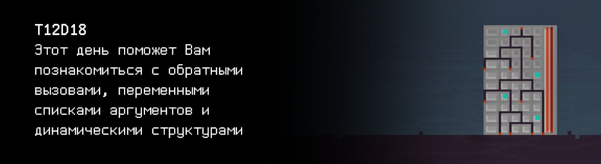

# T12D18


Foydali video materiallarni Platformadagi “Projects (Media)” bo‘limida topishingiz mumkin.




## Contents

1. [Chapter I](#chapter-i) \
 1.1. [Level 3. Room 4.](#level-3-Room-4)
2. [Chapter II](#chapter-ii) \
 2.1.  [Quest 1. Print Module.](#quest-1-print-module) 
3. [Chapter III](#chapter-iii) \
 3.1. [List 1.](#list-1) 
4. [Chapter IV](#chapter-iv) \
 4.1. [Quest 2. Checking Module.](#quest-2-checking-module) 
5. [Chapter V](#chapter-v) \
 5.1. [List 2.](#list-2) \
 5.2. [List 3.](#list-3) \
 5.3. [List 4.](#list-4) 
6. [Chapter VI](#chapter-vi) \
 6.1. [Quest 3. BST.](#quest-3-bst) \
 6.2. [Quest 4. Growing tree.](#quest-4-growing-tree) \
 6.3. [Quest 5. Three styles of traversing.](#quest-5-three-styles-of-traversing)
7. [Chapter VII](#chapter-vii)


# Chapter I

## Level 3. Room 4.

***LOADING Level 3… \
LOADING Room 4…***

\> *Atrofga qarash**

Faqat bitta eshikli xonaga kirding, u yerda kitoblar va devorda g‘alati narsalar yo‘q. Agar xona o‘rtasidagi bitta katta daraxtni olmasak, hammasi yaxshi va odatdagiday bo‘lardi. Nega bu bosqichda hamma xonalar g‘alati...\ 
Ish stansiyasiga yaqinlashgach, buyruq terminalida ochiq hisobotni - xoynahoy, injenerlardan bittasini ko‘rding. Va daraxtdan to‘kilgan bir nechta sariq barg...

\> *Hisobotni o‘rganish*

    Yaqinda yadro rejimining drayverini ishlab chiqarishga to‘g‘ri keldi.
    Bu ko‘p hamkasblarimning  jahlini chiqardi va muvaffaqiyatsiz injenerlik qadam deb hisoblandi.

    Men yozgan kodning har qanday qismiday bu drayverda bir nechta jiddiy xato bo‘lgan,
    ular bir qancha qiziq yon taʼsirli effektlarni keltirib chiqardi.
    Bu drayver boshqa drayverlarning yuklanishiga to‘sqinlik qildi va natijada tizim nosozliklariga olib keldi.

    Keyin ko‘p drayverlar ularning initsializatsialash tartiboti doim samarali deb hisoblashini bildim,
    nosozlikni bartaraf eta olishmaydi
    ...
    Bir necha yil oldin kodli nomi - virtual_j00ru bo‘lgan SI  shunga o’hshash vaziyatlarni maxsus jurnalda hujjatlashtirish uchun yaratilgan, va ularning ko‘plari hozir ham OТ nusxalarida mavjud.
    ...
    Natijada bu nosoz drayverlar muammo bo‘lmay qoldi:
    virtual_j00ru vazifasini yaxshi bajardi, hayotimni uzaytirdi. SI nafaqat drayverlar muammosini hal qilishda yordam berishini, balki menga va boshqa ko‘p odamlarga ancha yo‘nalishda yordam berishini tushundim: kodni tahlil qiladi, mantiqiy xatolarni topadi, hafta uchun sotib olinadigan narsalarning ro‘yxatini tuzadi, kerakli maʼlumotni topadi va hokazo.
    Shuning uchun uning funksiyalarini kengaytirishga diqqat qaratdim.
    Ishim ko‘p edi, birinchidan turli tuzilmalarni qo‘shish
    ...

***LOADING...***


# Chapter II

>**Diqqat!** Barcha fayllar, avval bo’ganiday loyihaning ildiz katalogida `build` papkasida joylashishi kerak.

## Quest 1. Print Module.

To‘satdan hisobot to‘xtadi va xato to‘g‘risidagi xabar chiqdi. Uni batafsil ko‘rib, chiqaruvchi modul shikastlanganini tushunding (kimning hayoliga kelibdi!), uni almashtirish kerak. Tizim o‘z modulini qo‘shishni taklif qildi.

\> *Kompyuterda hujjatlarni izlash*

Omad senga kuldi. Kompyuterda chiqaruvchi modul va hujjatlar to‘g‘risida biroz maʼlumot bor.


\> *Hujjatlarni o‘qish*

Hujjatlarni yuklab, o‘rganyapsan.

...

Hujjatlarni batafsil o’rganding va tizimda ekranga chiqaruvchi funksiya yo‘qligini tushunding:

`void print_log(char (*print) (char), char* message);`

Yana hujjatlarni batafsil o’rganib, tizim yadrosi teskari chaqiruv (callbacks) funksiyalarida ishlayotganini tushunding va ekranga chiqaruvchi funksiyani amalga oshirishni bilishing va uni modulga chaqirishing kerak.

***== Quest 1 qabul qilindi. src/print_module.c fayilida print_log funktsiyasini yozish, unga parametrlarda o‘tkazilgan funksiya yordamida quyidagi xabarni chiqarsin: «[LOG] hozirgi_xabar vaqti». Hozirgi vaqti SS:DD:SS  formatida bo’lsin. Kerak bo’lsa fayl o’zgartirilsin - src/main_module_entry_point.c. Dastur Makefile yordamida tuzilsin. Bosqich nomi - print_module, bajariladigan fayl nomi - Quest_1. ==***

***LOADING...***


# Chapter III

## List 1.

\> *O‘zgarishlarni omborga kiritish*

    System segmentation fault…
    Loading module structure seems to be broken
    System: Output stream module load… success
                    LOADING...
                      SUCCESS
        To‘xtagan joydan o‘qishni davom ettirmochimisiz?
                        N/Y

Hisobot davomida SI kodida ishlatish uchun kiritilgan bir nechta maʼlumot tuzilmalari ko‘rsatilgan. Har qanday katta dastur loyihasida bo‘lganiday maʼlumotlarning bu umumiy tuzilmalari va primitivlari  \kodda qayta ishlatilish uchun beriladi. Ishlab chiqaruvchilar imkon bo‘lganda ularni qayta ishlatishlari kerak.
Hujjatlarning keyingi qismlarida maʼlumotlarning umumiy tuzilmalar taʼrifi mavjud: tegishli ro‘yxatlar (Linked lists), navbatlar (Queues), xaritalar (Maps), binar daraxtlar (Binary Trees). Har bir bo‘limda taʼrifi, qo‘llash sohasi va algoritm qiyinligiga tegishli maʼlumot bor.

        SELECT DOCUMENT YOU WANT TO READ?
                    >...

                    ERROR…
                    
Matn chiqmay qoldi va tizim qolgan maʼlumotlarning to‘liqligini tekshirishni boshladi.

                UNRECOGNIZED OPERATION…
                FILTER MODULE: MISSED 

Katta log xatolar orasida tizim bir necha satrni belgiladi:

    System segmentation fault…
    Loading module structure seems to be broken
    missed or unknown header: stdarg.h
    missed or unknown header: varargs.h
    va_start can’t be used
    va_arg can’t be used
    va_end can’t be used
    use 'man stdarg' to get more information

\> *Bu nima?*

Kimdan so‘rayapsan, deganlariday...

***LOADING...***


# Chapter IV

## Quest 2. Checking Module.

Hujjatlarga ko‘ra, SI ning funksiya - modulini yozishing kerak, u quyidagi signaturaga ega:

`int* check_available_documentation_module(int (*validate) (char*), int document _count, ...);`

Signaturaga ko‘ra, funksiya har bir o‘tkazilgan parametrga teskari chaqiruv mexanizmni amalga oshirishi kerak.

***== Quest 2 qabul qilindi. src/documentation_module.c faylda check_available_documentation_module funksiyasini yozish, u parametrlarda o‘tkazilgan har bir hujjatda validatsiya funksiyasini amalga oshirsin, u ham parametlarda o‘tkazilgan. Dastur ishining natijasi hujjatlar massividan foydalanishdir, bu butun sonli massivlar (0 - hujjatdan foydalanib bo‘lmaydi, 1- hujjatdan foydalansa bo‘ladi). src/main_module_entry_point.c fayl o‘zgartirilsin, u qabul qilingan massiv yordamida hujjatlarning  odam o’qiy oladigan xulosasini amalga oshirsin (format: [hujjat nomi: (un)available]). Tekshiriladigan hujjatlar uchun chiqarish maydon o‘lchami 15 birlikka teng modifikatorni o‘rnat. Eʼtibor ber, funksiya tasodifiy argumentlar sonini qabul qiladi. Dastur Makefile yordamida tuzilsin. Bosqich nomi - documentation_module, bajariladigan fayl nomi - Quest_2. ==***

***LOADING...***


# Chapter V

## List 2.

> UNUTMANG! Sizning barcha dasturlaringizkod uslub normasi va xotira sarfi uchun tekshiriladi.
> Testlarni o'tkazish bo'yicha ko'rsatmalar ham `materials` papkasida joylashgan.

    Validating module…
    System segmentation fault…
    Loading module structure seems to be broken
    Checking available documents:
        1. Linked lists   : unavailable
        2. Queues         : unavailable
        3. Maps           : unavailable
        4. Binary Trees   : available

    Select document to open:
    >1
    LOADING...
    Document unavailable

    Select document to open:
    >2
    LOADING...
    Document unavailable

    Select document to open:
    >3
    LOADING...
    Document unavailable

    Select document to open:
    >4
    LOADING…
    LOAD: SUCCESS
    Do you want to read it now? 
    N/Y

***LOADING...***


## List 3.

    Taʼrif:
    Daraxt - bu maʼlumotlar tuzilmasi, u iyerarxik daraxt ko‘rinishidagi strukturani taʼminlaydi. 
    Matematik - bu atsiklik bog‘liq  yo‘naltirilgan graf, u yerdagi har bir cho‘qqi (bog‘lama deb ataladi) nol yoki bir nechta qirralarga va nol yoki bitta kiruvchi qirraga ega.

    Bitta element (ro‘yhat, bog‘lama) tuzilmasi quyidagicha taʼriflanadi:

```
typedef struct 		s_btree 
{
struct s_btree 	*left; 
struct s_btree 	*right;
int 			item; 
} t_btree;
```

    Binar daraxt - bu har bir bog‘lam Ikkitadan ko‘p qovurg‘aga ega bo‘lamaydi.

 \
1-rasm. Binar daraxti.

    PRESS PAGE DOWN TO CONTINUE

***LOADING...***


## List 4.

    Taʼrif:
    Binar daraxt qidiruvi (Binary search tree/BST) - bu aniq tartibli binar daraxti, u bog‘lamalariga o‘rnatilgan. 
    Tartib ko‘pincha quyidagi induksiya orqali belgilangan:
    Ildizning chap subdaraxti faqat ildizdan kichkina bo‘lgan qiymatga ega bog‘lamalardan iborat.
    Ildizning o‘ng subdaraxti faqat ildizdan katta bo‘lgan qiymatga ega bog‘lamalardan iborat.
    Barcha subdaraxtlar ham binar daraxt qidiruvi  deb hisoblanadi.


Characteristics:

|   | o‘rtacha | eng yomon holda |
| ------ | ------ | ------ |
| Xotira sarfi | O(n)      | O(n)    |
| Izlash         | O(log n)      | O(n)    |
| Kiritish       | O(log n)      | O(n) |
| O‘chirish       | O(log n)      | O(n) |

    Shunday ekan, binar daraxt qidiruvi - bu hamma bog‘lamalar tartibga solingan binar daraxt, chap kichik elementlari ularning katta elementlaridan kam qiymatga ega, o‘ng kichik elementlar esa katta elementlaridan ko‘proq qiymatga ega. Demak, belgilangan bog‘lama qidiruvi ham, tartib bo‘yicha o‘tish ham samarali (logarifmik va chiziqli).

 \
2-rasm. Binar daraxt qidiruvi.

    END OF CURRENT DOCUMENT
    PRESS ANY KEY TO RETURN…

    Validating module…
    System segmentation fault…
    AI documentation module found but not loaded correctly… 
    Hint: Try to sort modules in the right order

***LOADING...***


# Chapter VI

## Quest 3. BST.

\> *Nima qilsa bo‘larkan?*

Xoynahoy, tizimning oddiy maslahatlariga amal qilish va binar daraxt qidiruvi yordamida SI modullarini saralash kerak. Har bir modul 0 dan 10 gacha sonli id ga ega. Kompyuterdagi maʼlumotga ko‘ra, hujjatlar moduli 4 identifikatoriga ega. \
Baxtinga, daraxt (ro’yhat) elementining tuzilmasi hujjatlarda berilgan.

Birinchi navbatda, src/bst.c da bog‘lama yaratish uchun funksiya yozish kerak (funksiya bog‘lamada qiymatni saqlashi va kichik bog‘lamalar ilk holatlarini initsializatsiyalashi kerak). Funksiya signaturasi quyidagicha ko‘rinsin:

`t_btree *bstree_create_node(int item)`

t_btree turi sarlavha faylida taʼriflansin. Oxirida bog‘lama yaratish funksiyasi src/bst_create_test.c da modul testlash yordamida tekshirilsin, bu ilgari ham qilingan.

***== Quest 3 qabul qilindi. src/bst.c dasturi yig’ilsin, u yerda bstree_create_node binar daraxt qidiruv bog‘lamasini yaratish funksiyasini amalga oshirish. src/bst.h da daraxt bog‘lamasi turining taʼrifini joylashtirish. Modul sinov yordamida src/bst_create_test.c da bajarilgan funksiyasini tekshirish (yaratilgan narsaning chiqishi bilan kamida ikkita kiruvchi qiymati). Dastur Makefile yordamida tuzilsin. Bosqich nomi - bst_create_test, bajarilgan fayl nomi - Quest_3. ==***

***LOADING...***


## Quest 4. Growing tree.

\> *Tayyor*


Endi, bitta elementni yaratish funksiyasi tayyor bo‘lganda, keyingi bog‘lamani kiritish yordamida butun daraxtni yaratishga o‘tsa bo‘ladi.

Funksiya signaturasi quyidagicha ko‘rinsin  va  src/bst.c da joylashtirilsin:

`void bstree_insert(t_btree *root, int item, int (*cmpf) (int, int));`

Signaturadan shuni ko‘rish mumkinki, bog‘lamalar qiymatini cmpf teskari chaqiruv funksiyasi yordamida solishtirish kerak. \
Oxirida funksiyani src/bst_insert_test.c da kamida ikkita turli kiruvchi qiymatlar to‘plami va daraxt bog’lamasi solinadigan chiqish bilan tekshirish kerak.

***== Quest 4 qabul qilindi. src/bst.c dasturiga bstree_insert binar daraxt qidiruvi  bog‘lamasini kiritish funksiyasini amalga oshirish orqali qo‘shish. Modul sinovi yordamida bajarilgan funksiyani src/bst_insert_test.c da tekshirish (kamida ikkita turli kiruvchi qiymatlar to‘plami bilan daraxt ro’yhat bargi solingan chiqish joyi). Komparator funksiyasini amalga oshirish tayyorlansin. Dastur Makefile yordamida tuzilsin. Bosqich nomi -  bst_insert_test, bajarilgan fayl nomi - Quest_4.  ==***

***LOADING...***


## Quest 5. Three styles of traversing.

\> *Видимо, теперь остался обход дерева*

Daraxt bo‘ylab o‘tish funksiyasi yozilsin. To‘g‘ri yuklash uchun SI hujjatlarining modullarini qaysi tartibda joylashtirish kerakligi haqida maʼlumot yo‘qligi uchun daraxt bo‘ylab o‘tish bo‘yicha 3 turli (traverse) funksiya yozish kerak:
- infix - elementlar o‘sish tartibida ko‘rsatiladi 
(chap subdaraxt -> ildiz -> o‘ng subdaraxt);
- prefix - elementlar saqlangan tartibida ko‘rsatiladi 
(ildiz -> chap subdaraxt -> o‘ng subdaraxt);
- postfix - elementlar kamayish tartibida ko‘rsatiladi
(chap subdaraxt -> o‘ng subdaraxt -> ildiz).

Funksiyalar signaturasining ko‘rinishi quyidagicha, hammasi src/bst.c da joylashsin:

`void bstree_apply_infix(t_btree *root, void (*applyf) (int));`

`void bstree_apply_prefix(t_btree *root, void (*applyf) (int));`

`void bstree_apply_postfix(t_btree *root, void (*applyf) (int));`

applyf - teskari chaqiruv funksiyasi bog‘lama qiymatini o‘tkazsin. Bunday funksiya, masalan, maʼlumotni ekranga chiqarishi mumkin. \
Testlar uchun oldingi testdan kiruvchi maʼlumotlar to‘plami olinsin, src/bst_traverse_test.c da uchta turli usul orqali ekranga chiqarilsin.

***== Quest 5 qabul qilindi. src/bst.c dasturini bstree_apply_infix, bstree_apply_prefix, bstree_apply_postfix  binar daraxt qidiruvi bo‘ylab o‘tish funksiyalarining amalga oshirish orqali to‘ldirish. Modul sinov yordamida src/bst_traverse_test.c da yozilgan funksiyalar tekshirilsin (oldingi testdan kiruvchi maʼlumotlar to‘plamini olib, daraxtlar ekraniga uchta turli usul orqali chiqarish). applyf funksiyasi terminalga bog‘lama qiymatini kiritadigan funksiyani amalga oshirish sifatida tayyorlash. Dastur Makefile yordamida tuzilsin. Bosqich nomi -  bst_traverse_test,  bajarilgan fayl nomi - Quest_5. ==***

***LOADING...***


# Chapter VII

\> *Yechimni omborga kiritish*

Terminalda tekshiruv satrlari paydo bo‘ldi, hisobotni o‘qishni to‘xtatmoqchi bo‘lding.

    Validating module… 
    ... 
    Success 
    ...

Modullar validatsiyani to‘liq tugatguncha 15 daqiqa kutding va kompyuter qotib qolganini, hech qanday buyruqlarga javob bermaganini tushunding.

\> *Kompyuterda qayta ishga tushirish tugmasiga bosish!

Ekran o‘chdi, tizim blokidan tutun chiqdi. Xoynahoy, u qaynab ketdi yoki nimadir uni isitib tashladi... \
Aqling yetmadi, chunki xonadagi eshik xuddi uzilib, daraxt tomon uchib ketganday bo‘ldi... \
«Xo‘sh, chiqish ochiq, kompyuter buzildi. Afsuski, hisobotni oxirigacha o‘qish imkonsiz. SI ham qayergadir g‘oyib bo‘ldi. U qaytmasa ham yahshi bo’lardi. Usiz ham daraxtlar bilan ish bajarilyapti», - deb o‘ylading va ketding.

***LOADING...***

